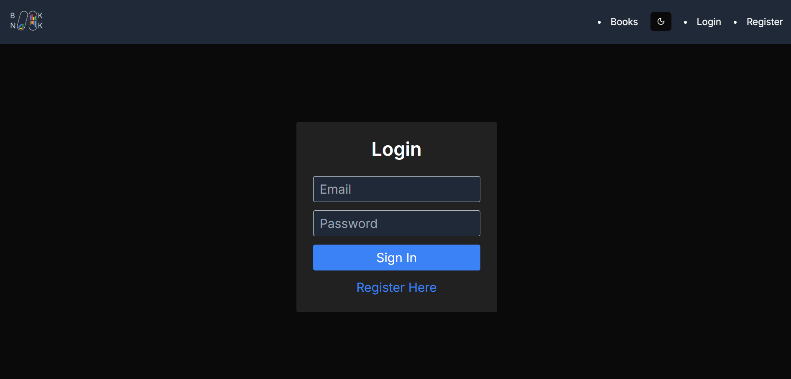
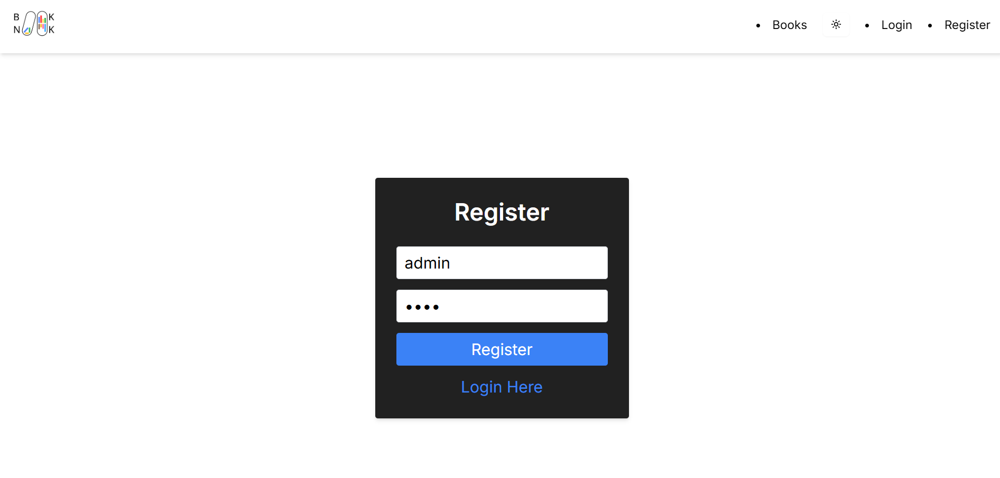
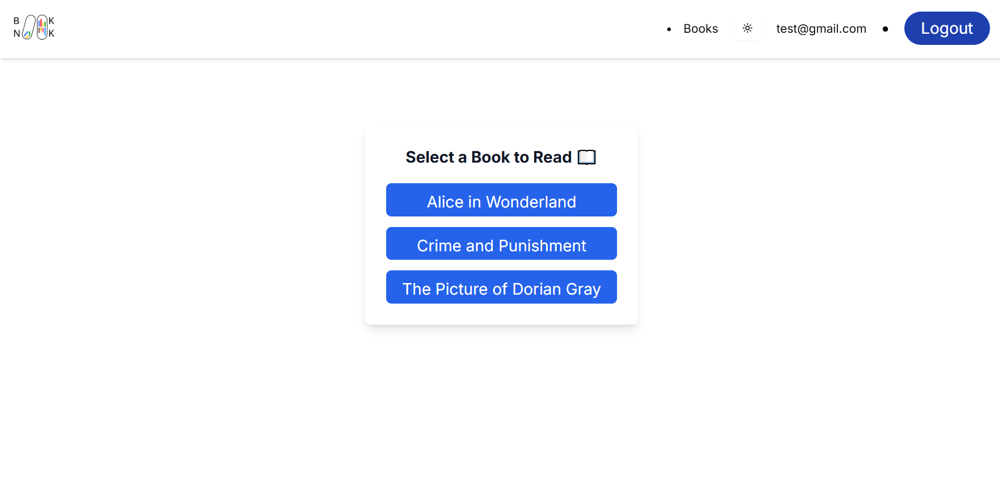
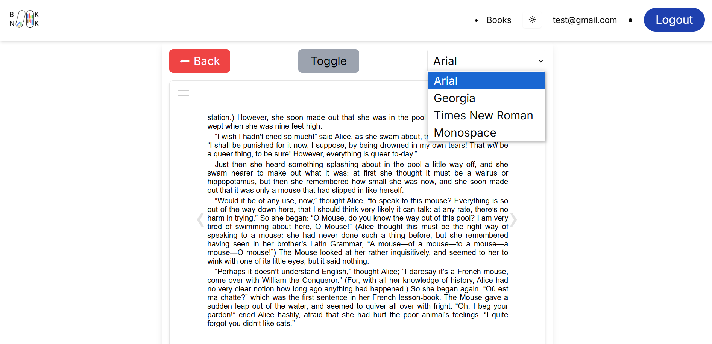
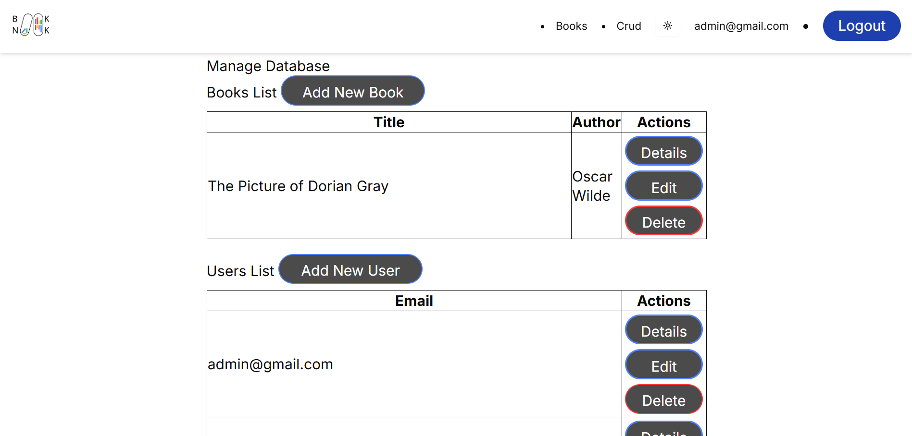

<!DOCTYPE html>
<html lang="en">
  <head>
    <meta charset="UTF-8" />
    <meta name="viewport" content="width=device-width, initial-scale=1.0" />
  </head>
  <body>
    <header>
      <h1>BookNook</h1>
    </header>
    <section>
      <h2>Overview:</h2>
      

      

        The idea came because of our grannies. They want to read, but don't have
        time or opportunity to go to the library.
      

      

        We wanted to give them an easy way to access their favourite pieces of
        literature.
      

    </section>
    <section>
      <h2>Features:</h2>
      <ul>
        <li>View different books</li>
        <li>Create and log in with an individual account</li>
        <li>User friendly interface</li>
        <ul>
          <li>Toggle font size</li>
          <li>Change fonts</li>
          <li>Switch between light and dark themes</li>
        </ul>
        <li>CRUD for both users and books</li>
        <ul>
          <li>Add books/users</li>
          <li>Edit books/users</li>
          <li>Delete books/users</li>
          <li>Hashing for passwords</li>
        </ul>
      </ul>
    </section>
    <section>
      <h2>How to run the project:</h2>
      <ol>
        
Requirements for running the project : Node.js

        <li>Clone the project to your local machine</li>
        <li>Open the project using your desired environment</li>
        <li>
          Write in the console: npm install (that installs all the needed
          dependencies)
        </li>
        <li>After the installation is complete write: npm run dev</li>
        <li>Open in desired browser and enjoy!</li>
      </ol>
    </section>
    <section>
      <h2>Technology:</h2>
      <ul>
        <li>Frontend:</li>
        <ul>
          <li>React</li>
          <li>Css</li>
          <li>Next.js</li>
        </ul>
        <li>API Integration - MongoDB</li>
        <li>Environment -VS Code</li>
        <li>Design - Figma</li>
        <li>Dependencies:</li>
        <ul>
          <li>css: Version 3.0.0</li>
          <li>next: Version 15.1.6</li>
          <li>mongoose: Version 8.10.1</li>
          <li>epubjs: Version 0.3.93</li>
          <li>bcryptjs: Version 3.0.1</li>
        </ul>
      </ul>
    </section>
    <section>
      <h2>Usage:</h2>
       

        The site has both dark and light theme for better user experience.
      

      
       
      

        Create an account, after creating it, the app redirects you to the Log
        In page.
      

      
      
      

        After you log in you will be able to access the books. A user without an
        account cannot view them.
      

      
      

        You can choose the font you'd like to read it with.
      

      
       

        You can adjust the font size for better viewing.
      

       
      

        Only the master admin is able to see the 'Crud' tab and has access to
        it.
      

      
      

        In the crud page, the admin can edit, delete, add and view the details
        of the users and the books.
      

      
      
      

        When adding or changing the user the password is hidden to keep
        confidentiality.
      

      
      

       When deleting from the database a confirmation pops up to prevent accidents.
      

      
    </section>
    <footer>
      
The project was created by the one and only: “Slayers”

      

        Frontend: Irina Semenyakina -
        <a href="mailto:kittifeya@gmail.com">kittifeya@gmail.com</a>
      

      

        Backend: Doriana Petkova –
        <a href="mailto:doriana.petkova@gmail.com">doriana.petkova@gmail.com</a>
      

      
    </footer>
  </body>
</html>
